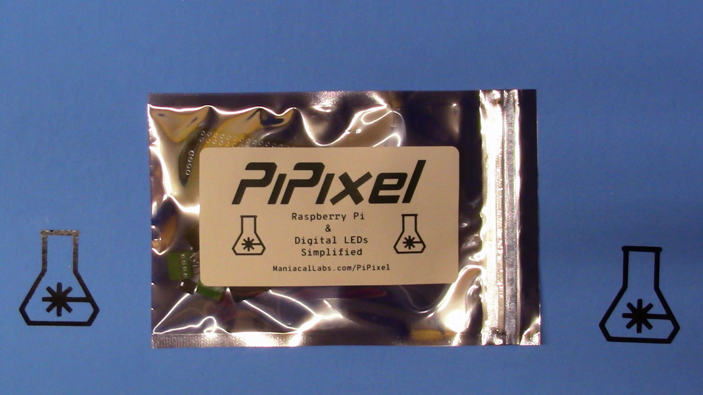
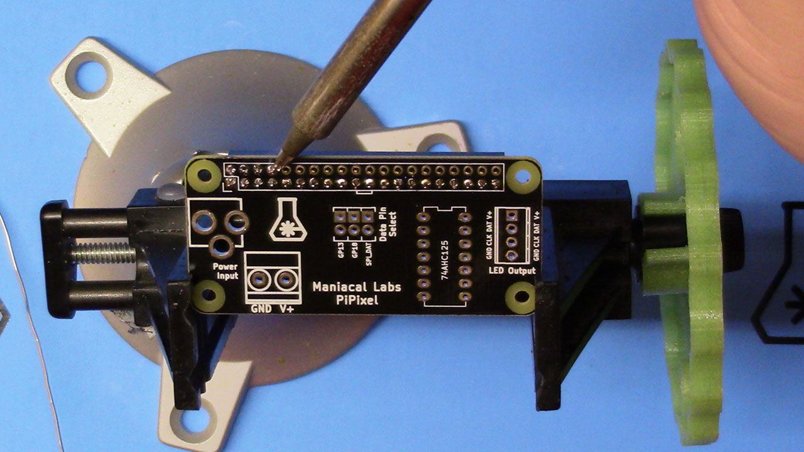
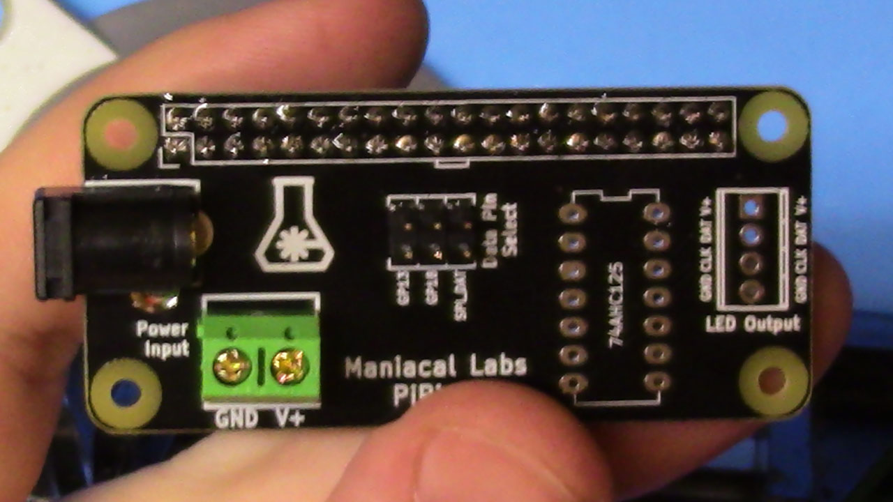
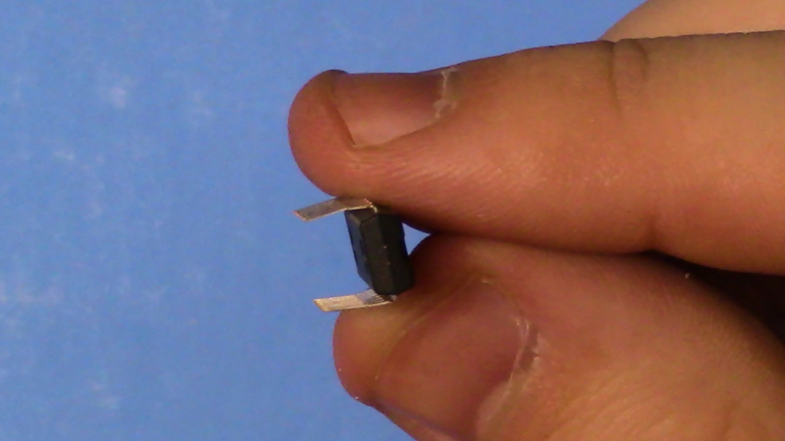
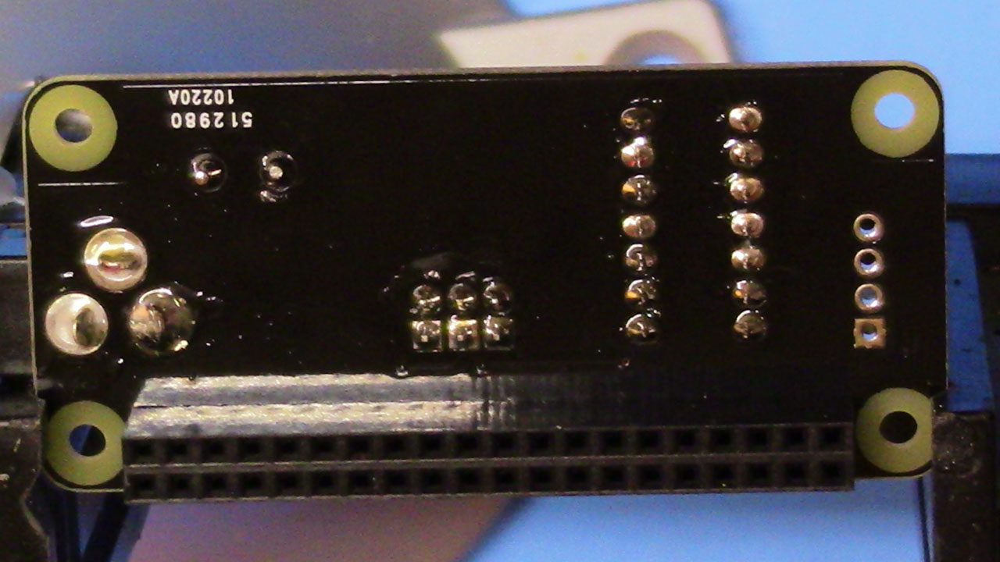
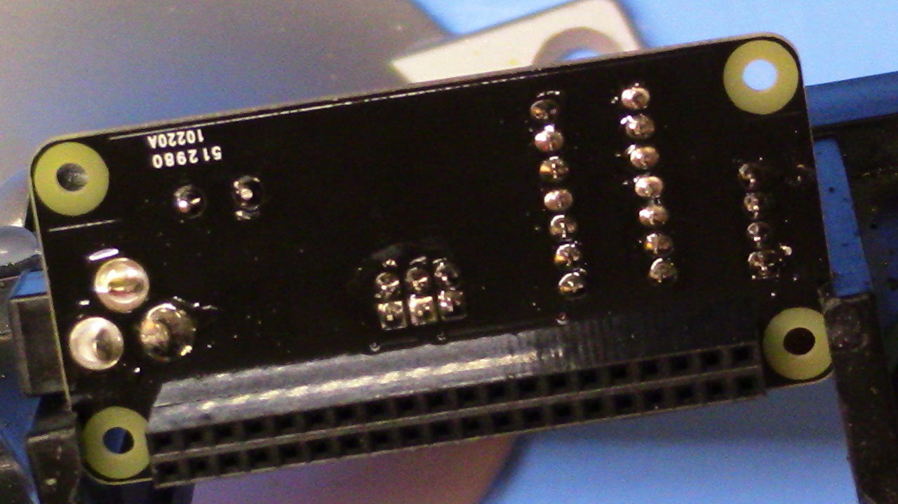
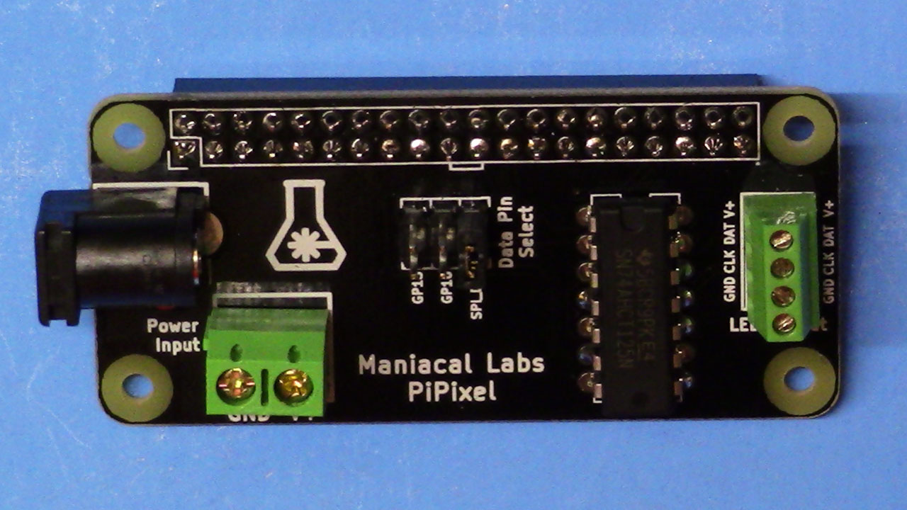

## PiPixel Assembly

The PiPixel is a simple kit with minimal parts and only requires basic soldering skills. You can either follow along with the instructions in this document or follow the build process in the video below:

#### Kit Contents

Your PiPixel kit should contain the following items, as shown above:
- PiPixel PCB
- Female 2x20 Header for connection to Pi
- 2.1 / 5.5 mm barrel jack for power input option #1
- 5mm pitch dual screw terminal for power input option #2
- 74AHCT125 Level Shifter
- 4 pin screw terminal for data/power output
- 2x3 pin header and jumper for data line selection

#### Female Header

*Note: You may also want to use a male header or pass-through header, depending on your situation. But as most will need the female header that is what he provide. See the main [README](README.md) for links to other header options.*

First, we recommend placing the PCB with the header inserted onto your work surface, and soldering just a single pin. Now that the header will stay on, hold the PCB and provide pressure to the back of the header while re-heating the one solder joint. You can now ensure the header is properly aligned and hold it in place while the solder cools.

Next, solder the remainder of the header pins.

#### Barrel Jack

Insert the barrel jack, then flip over the PCB. Apply a small amount of solder to a single pin. Then now use your free hand (which is no longer holding solder) to, like with the female header, apply a little pressure while re-heating the solder to ensure the jack is properly aligned.

Then solder the other two barrel jack pins, taking your time to ensure the holes are completely filled with solder. Then go back to the first pin and add the remaining solder to fill the hole.

#### Power Screw Terminal & Data jumper

Insert the power screw terminal (ensure the holes face outward!) and the 2x3 jumper header.

Flip the PCB and solder the screw terminal pins and the jumper header pins. Like with previous parts, ensure that the components are aligned correctly before soldering all pins.

#### 74AHCT125 Level Shifter

**_IMPORTANT!_**: The level shifter has a notch on one side and the PCB silkscreen shows a notch as well. Those notches *__must__* be aligned or the PiPixel will not work!

The pins on the level shifter will be angled outward and need to be bent in slightly to fit in the socker. Place each side of the IC against your work surface and gently press down to bend the pins slightly inward, so they look like below:

Finally, insert the level shifter, noting the notch orientation, and solder all pins.

#### 4-pin Screw Terminal

Insert the 4-pin data/power terminal, flip the PCB laying it flat on your work surface and solder one pin. Ensure it is aligned properly and reheat and fix if not.

The solder the remaining screw terminal pins.

Congratulations, you're done!

For all the details on using the PiPixel, checkout the [Usage](Usage.md) doc.
